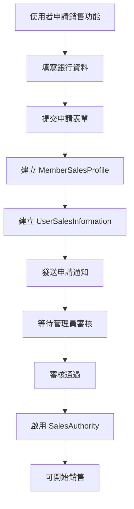

# GameCore 錢包系統實作指南

## 概述

GameCore 錢包系統是一個完整的點數管理和交易追蹤系統，支援多來源收支明細彙整、銷售功能管理、以及完整的交易處理流程。本系統嚴格遵循原有資料庫結構，不進行任何架構修改。

## 系統架構

### 三層式架構設計

```
┌─────────────────────────────────────────────────────────────┐
│                     展示層 (Presentation Layer)              │
├─────────────────────────────────────────────────────────────┤
│ • WalletController.cs - API 控制器                          │
│ • Views/Wallet/Index.cshtml - 錢包管理介面                 │
│ • wwwroot/js/wallet.js - 前端互動邏輯                      │
└─────────────────────────────────────────────────────────────┘
                                │
                                ▼
┌─────────────────────────────────────────────────────────────┐
│                     業務邏輯層 (Business Logic Layer)        │
├─────────────────────────────────────────────────────────────┤
│ • IWalletService.cs - 錢包服務介面                          │
│ • WalletService.cs - 錢包服務實作                           │
│ • WalletDTOs.cs - 資料傳輸物件                              │
└─────────────────────────────────────────────────────────────┘
                                │
                                ▼
┌─────────────────────────────────────────────────────────────┐
│                     資料存取層 (Data Access Layer)           │
├─────────────────────────────────────────────────────────────┤
│ • GameCoreDbContext.cs - 資料庫上下文                       │
│ • User.cs, UserWallet.cs - 實體模型                        │
│ • 05-WalletSeedData.sql - 種子資料                          │
└─────────────────────────────────────────────────────────────┘
```

## 核心功能模組

### 1. 基本錢包功能

#### 錢包資訊查詢
- **端點**: `GET /api/wallet`
- **功能**: 取得使用者完整錢包資訊
- **回應**: 點數餘額、優惠券、銷售權限狀態

```csharp
// 使用範例
var wallet = await _walletService.GetWalletAsync(userId);
// 回傳: WalletDto 包含 CurrentPoints, CouponNumber, HasSalesAuthority
```

#### 點數餘額檢查
- **端點**: `GET /api/wallet/balance`
- **功能**: 快速查詢點數餘額
- **用途**: 購買前檢查、即時餘額顯示

#### 點數充足性驗證
- **端點**: `GET /api/wallet/check-sufficient?points=100`
- **功能**: 檢查是否有足夠點數進行特定消費
- **回應**: `{ sufficient: true/false, requiredPoints: 100 }`

### 2. 收支明細彙整系統

#### 多來源交易記錄整合

按照規格要求，從以下來源彙整交易記錄：

1. **簽到記錄** (`UserSignInStats`)
   - 每日簽到獲得點數
   - 週末加成、連續獎勵
   - 全月勤獎勵

2. **小遊戲記錄** (`MiniGame`)
   - 冒險勝利獲得點數
   - 冒險失敗扣除點數
   - 經驗值獲得

3. **寵物換色記錄** (`Pet`)
   - 換色消費 2000 點數
   - 僅記錄最近一次 (資料庫限制)

4. **管理員調整記錄** (`Notifications`)
   - 管理員手動調整點數
   - 包含調整原因和操作者
   - 作為稽核證明

#### API 查詢介面

```http
GET /api/wallet/ledger?from=2024-01-01&to=2024-01-31&type=signin&page=1&pageSize=20&sortBy=date_desc
```

**支援篩選條件**:
- `from/to`: 時間範圍篩選
- `type`: 交易類型 (signin, minigame, pet_color, adjustment)
- `page/pageSize`: 分頁設定
- `sortBy`: 排序方式 (date_desc, date_asc, amount_desc, amount_asc)

### 3. 銷售功能管理

#### 銷售檔案申請流程



#### 銷售檔案資料結構

```csharp
public class CreateSalesProfileDto
{
    public int BankCode { get; set; }                    // 銀行代號
    public string BankAccountNumber { get; set; }       // 銀行帳號
    public string? AccountCoverPhotoBase64 { get; set; } // 封面照片 (Base64)
    public string? ApplicationReason { get; set; }      // 申請理由
}
```

#### 銷售錢包管理

- **銷售收入追蹤**: 記錄累計銷售額、平台手續費
- **可提領金額管理**: 計算可提領餘額
- **月收入統計**: 提供月度銷售報表

### 4. 交易處理系統

#### 點數消費流程

```csharp
// 消費點數 API
POST /api/wallet/spend
{
    "points": 100,
    "purpose": "寵物換色",
    "referenceId": "pet_123"
}
```

**處理步驟**:
1. 驗證使用者身份
2. 檢查點數餘額充足性
3. 原子性扣除點數
4. 記錄交易明細
5. 回傳交易結果

#### 點數獲得流程

```csharp
// 獲得點數 API (內部使用)
POST /api/wallet/earn
{
    "points": 50,
    "source": "每日簽到",
    "referenceId": "signin_123"
}
```

### 5. 統計與分析

#### 點數統計摘要

```http
GET /api/wallet/statistics
```

**回傳資料**:
```json
{
    "totalPoints": 1500,
    "todayEarned": 50,
    "todaySpent": 20,
    "weekEarned": 200,
    "weekSpent": 100,
    "monthEarned": 800,
    "monthSpent": 300,
    "earningsBySource": {
        "每日簽到": 400,
        "小遊戲獎勵": 350,
        "管理員調整": 50
    },
    "spendingByCategory": {
        "寵物換色": 200,
        "商城購買": 100
    }
}
```

## 資料庫設計

### 現有資料表使用

1. **User_wallet** - 使用者錢包主表
   ```sql
   User_Id int [pk, fk]           -- 使用者編號
   User_Point int                 -- 點數餘額
   Coupon_Number varchar          -- 優惠券編號
   ```

2. **MemberSalesProfile** - 銷售檔案表
   ```sql
   User_Id int [pk, fk]           -- 使用者編號
   BankCode int                   -- 銀行代號
   BankAccountNumber varchar      -- 銀行帳號
   AccountCoverPhoto varbinary    -- 帳戶封面照片
   ```

3. **User_Sales_Information** - 銷售錢包表
   ```sql
   User_Id int [pk, fk]           -- 使用者編號
   UserSales_Wallet int           -- 銷售錢包餘額
   ```

### 交易記錄來源表

- **UserSignInStats** - 簽到記錄
- **MiniGame** - 小遊戲記錄
- **Pet** - 寵物互動記錄
- **Notifications** - 系統通知 (管理員調整)

## 前端介面設計

### 錢包管理頁面 (`/Views/Wallet/Index.cshtml`)

#### 主要區塊

1. **錢包概覽**
   - 當前點數餘額大字顯示
   - 今日/本週/本月收支統計
   - 重新整理按鈕

2. **收支明細**
   - 分頁式交易清單
   - 篩選控制項 (時間範圍、交易類型)
   - 排序功能

3. **銷售功能管理**
   - 銷售檔案申請表單
   - 銷售權限狀態顯示
   - 銀行資料管理

4. **銷售錢包**
   - 銷售收入顯示
   - 月度統計
   - 提領功能 (規劃中)

#### 設計特色

- **Glass-morphism 設計風格**: 遵循專案設計規範
- **響應式佈局**: 支援手機、平板、桌面
- **即時資料更新**: Ajax 無刷新載入
- **無障礙設計**: 支援螢幕閱讀器、鍵盤導航

### JavaScript 功能

```javascript
// 主要功能函數
loadWalletData()           // 載入錢包資料
loadTransactionHistory()   // 載入交易記錄
filterTransactions()       // 篩選交易
applySalesProfile()        // 申請銷售功能
refreshWallet()           // 重新整理全部資料
```

## 安全考量

### 身份驗證與授權

1. **JWT Token 驗證**: 所有 API 需要有效 JWT
2. **Claims 檢查**: 使用 `ClaimTypes.NameIdentifier` 取得使用者 ID
3. **角色權限控制**: 管理員功能需要 `Admin` 角色
4. **銷售權限檢查**: 銷售相關功能需要 `SalesAuthority` 宣告

### 資料保護

1. **銀行帳號遮蔽**: 僅顯示後四碼
2. **交易原子性**: 使用資料庫交易確保一致性
3. **輸入驗證**: 前後端雙重驗證
4. **SQL 注入防護**: 使用 Entity Framework 參數化查詢

### 稽核追蹤

1. **管理員操作記錄**: 所有點數調整都有通知記錄
2. **交易日誌**: 完整記錄所有點數異動
3. **錯誤日誌**: 結構化記錄所有錯誤

## 測試策略

### 單元測試 (`WalletControllerTests.cs`)

1. **控制器測試**: 驗證 API 端點行為
2. **服務層測試**: 驗證業務邏輯正確性
3. **錯誤處理測試**: 驗證異常情況處理
4. **驗證測試**: 驗證輸入資料檢查

### 整合測試

1. **資料庫連線測試**: 驗證 Entity Framework 設定
2. **API 整合測試**: 端對端 API 呼叫測試
3. **交易一致性測試**: 驗證交易原子性

### 效能測試

1. **收支明細查詢效能**: 測試大量資料分頁查詢
2. **併發交易測試**: 測試多使用者同時交易
3. **快取效能測試**: 驗證快取機制效果

## 部署指南

### 必要步驟

1. **資料庫遷移**
   ```sql
   -- 執行種子資料腳本
   sqlcmd -S server -d GameCore -i 05-WalletSeedData.sql
   ```

2. **服務註冊**
   ```csharp
   // Program.cs 中確認服務註冊
   builder.Services.AddScoped<IWalletService, WalletService>();
   ```

3. **路由設定**
   ```csharp
   // 確認控制器路由正確
   app.MapControllerRoute(name: "wallet", pattern: "wallet/{action=Index}");
   ```

### 設定檔案

```json
// appsettings.json
{
    "ConnectionStrings": {
        "DefaultConnection": "Server=...;Database=GameCore;..."
    },
    "Wallet": {
        "PetColorChangeCost": 2000,
        "DefaultSignInPoints": 20,
        "WeekendSignInPoints": 30,
        "SevenDayBonusPoints": 40,
        "MonthlyBonusPoints": 200
    }
}
```

## 常見問題與解決方案

### Q1: 錢包餘額不正確

**原因**: 可能是多來源交易記錄同步問題
**解決**: 執行餘額重新計算腳本
```sql
-- 重新計算使用者錢包餘額
EXEC sp_RecalculateWalletBalances;
```

### Q2: 交易記錄缺失

**原因**: 其他系統未正確呼叫錢包 API
**解決**: 檢查簽到、小遊戲系統是否正確整合錢包服務

### Q3: 銷售功能申請失敗

**原因**: 銀行代號驗證錯誤或重複申請
**解決**: 檢查 `MemberSalesProfile` 表是否已有記錄

### Q4: 前端載入錯誤

**原因**: API 權限問題或 JWT 過期
**解決**: 檢查認證狀態，重新登入

## 未來擴展規劃

### 短期功能

1. **提領功能**: 銷售錢包提領到銀行帳戶
2. **優惠券系統**: 完整優惠券使用流程
3. **交易限制**: 單日消費限額設定

### 中期功能

1. **多幣種支援**: 支援不同遊戲幣種
2. **交易手續費**: 彈性手續費設定
3. **VIP 等級**: 基於消費金額的會員等級

### 長期功能

1. **區塊鏈整合**: 交易記錄上鏈
2. **AI 推薦**: 基於消費行為的個人化推薦
3. **風險控制**: 異常交易檢測與防護

## 技術支援

### 開發團隊聯繫

- **主要開發者**: GameCore 開發團隊
- **文件維護**: 系統架構師
- **問題回報**: GitHub Issues
- **緊急聯繫**: 技術負責人

### 相關資源

- [API 文件](./API-Documentation.md)
- [資料庫設計文件](./Database-Design.md)
- [部署指南](./Deployment-Guide.md)
- [測試報告](./Test-Report.md)

---

*本文件最後更新: 2024年8月24日*
*版本: v2.0*
*適用於: GameCore Stage 2 - Wallet/Sales 模組*