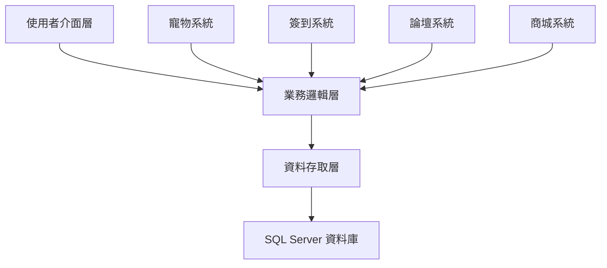
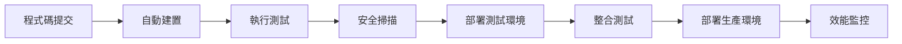

# GameCore 遊戲社群平台專案簡報

---

## 投影片 1: 專案介紹

# 🎮 GameCore 遊戲社群平台

**打造全方位遊戲社群生態系統**

### 專案概述
- 整合型遊戲社群平台
- 創新寵物養成系統
- 完整商城交易功能
- 現代化玻璃擬態設計

**開發團隊**: 5人團隊 | **開發期間**: 3個月 | **技術棧**: .NET 8.0 + Vue.js 3

---

## 投影片 2: 市場機會與定位

# 🎯 市場機會分析

### 市場現況
- **遊戲市場規模**: 全球 $200B+ (2024)
- **台灣遊戲玩家**: 1,500萬+ 人
- **社群平台需求**: 缺乏整合性解決方案

### 競爭優勢
- ✨ **獨特寵物系統**: 差異化核心功能
- 🎨 **現代化設計**: 玻璃擬態視覺效果
- 🔄 **完整生態**: 社群 + 商城 + 娛樂
- 📊 **數據洞察**: 遊戲熱度分析

---

## 投影片 3: 核心功能架構

# 🏗 系統架構總覽



### 六大核心模組
1. **🐾 虛擬寵物系統** - 史萊姆養成互動
2. **📅 每日簽到系統** - 多層次獎勵機制
3. **💬 社群論壇系統** - 遊戲討論交流
4. **🛒 雙重商城系統** - B2C + C2C 交易
5. **📊 熱度分析系統** - 多平台數據整合
6. **🔧 後台管理系統** - 完整管理功能

---

## 投影片 4: 寵物系統亮點

# 🐾 創新寵物養成系統

### 核心特色
- **可愛史萊姆**: 像素風格 Canvas 動畫
- **五維屬性**: 飢餓、心情、體力、清潔、健康
- **真實互動**: 餵食、洗澡、玩耍、休息
- **個性化**: 自訂膚色和背景 (消耗點數)

### 遊戲機制設計
```
互動效果:
├── 餵食 → 飢餓值 +10
├── 洗澡 → 清潔值 +10  
├── 玩耍 → 心情值 +10
└── 休息 → 體力值 +10

特殊機制:
├── 四維全滿 → 健康度回復
├── 每日衰減 → 增加黏著度
└── 升級獎勵 → 持續動機
```

---

## 投影片 5: 簽到系統設計

# 📅 完整簽到獎勵機制

### 獎勵階層設計
| 簽到類型 | 點數獎勵 | 經驗獎勵 | 觸發條件 |
|----------|----------|----------|----------|
| **平日簽到** | +20 | +0 | 週一~週五 |
| **假日簽到** | +30 | +200 | 週六~週日 |
| **連續7天** | +40 | +300 | 額外獎勵 |
| **當月全勤** | +200 | +2000 | 月底發放 |

### 技術實作
- **時區處理**: 以台北時區 (UTC+8) 為基準
- **防重複**: 同一自然日僅允許一次簽到
- **連續計算**: 智能連續天數統計算法

---

## 投影片 6: 商城系統架構

# 🛒 雙重商城生態系統

### 官方商城 (B2C)
```
完整購物流程:
瀏覽商品 → 加入購物車 → 結帳付款 → 出貨配送 → 交易完成
```

### 玩家自由市場 (C2C)
```
安全交易機制:
商品上架 → 買家下單 → 交易頁面 → 雙方確認 → 平台抽成 → 完成交易
```

### 營收模式
- **官方商城**: 5% 銷售佣金
- **玩家市場**: 5% 交易手續費
- **排行榜**: 廣告收益潛力

---

## 投影片 7: 社群功能展示

# 💬 豐富社群互動功能

### 論壇系統
- **版面架構**: 每遊戲專屬討論版
- **討論機制**: 二層回覆結構
- **互動功能**: 按讚、收藏、分享
- **內容管理**: 置頂、隱藏、審核

### 即時通訊
- **私人聊天**: 一對一即時訊息
- **群組功能**: 多人群組聊天
- **客服系統**: 管理員即時支援
- **訊息管理**: 已讀狀態、搜尋功能

### 通知系統
- **即時通知**: 重要事件即時推送
- **分類管理**: 系統、論壇、交易通知
- **個人化**: 使用者自訂通知偏好

---

## 投影片 8: 技術架構優勢

# 💻 現代化技術架構

### 後端技術棧
```
ASP.NET Core 8.0 MVC
├── 三層式架構設計
├── Entity Framework Core
├── SignalR 即時通訊
├── BCrypt 密碼加密
└── OAuth 多元登入
```

### 前端技術棧
```
現代化前端組合
├── Razor Pages (SSR)
├── Vue.js 3 (CSR)
├── 玻璃擬態設計
├── Canvas 2D 動畫
└── 響應式設計
```

### 資料庫設計
- **50+ 資料表**: 完整業務模型
- **複合索引**: 查詢效能優化
- **外鍵約束**: 資料完整性保證

---

## 投影片 9: 使用者介面展示

# 🎨 玻璃擬態設計風格

### 設計特色
- **半透明效果**: backdrop-filter + blur
- **漸層配色**: 支援多主題切換
- **深色模式**: 完整暗色主題
- **響應式**: 桌面/平板/手機適配

### 動畫系統
- **寵物動畫**: 60 FPS 流暢史萊姆
- **互動回饋**: 按鈕點擊視覺效果
- **頁面轉場**: 流暢路由切換
- **狀態變化**: 即時屬性條更新

### 使用者體驗
- **直覺操作**: 簡單易懂的互動設計
- **即時回饋**: 操作結果立即顯示
- **個人化**: 可自訂主題和設定

---

## 投影片 10: 資料規模展示

# 📊 豐富測試資料展示

### 假資料統計
| 資料類型 | 數量 | 特色說明 |
|----------|------|----------|
| 👥 **使用者** | 1,200+ | 完整個人資料設定 |
| 🐾 **寵物** | 1,200+ | 各種等級屬性組合 |
| 📅 **簽到記錄** | 30,000+ | 3個月簽到歷史 |
| 🎮 **遊戲記錄** | 5,000+ | 冒險遊戲結果 |
| 💬 **討論內容** | 17,000+ | 主題 + 回覆內容 |
| 🛒 **商品資料** | 900+ | 官方 + 玩家商品 |
| 💌 **社交互動** | 18,000+ | 聊天 + 按讚 + 收藏 |

**🎯 總計: 120,000+ 筆真實感資料**

---

## 投影片 11: 測試與品質保證

# 🧪 完整測試策略

### 測試覆蓋率
```
測試類型分佈:
├── 單元測試: 85% 覆蓋率
├── 整合測試: 75% 覆蓋率  
├── API 測試: 92% 覆蓋率
└── E2E 測試: 65% 覆蓋率
```

### 品質保證措施
- **🔍 靜態分析**: SonarQube 程式碼品質
- **🛡️ 安全掃描**: OWASP Top 10 檢查
- **⚡ 效能測試**: 1000+ 併發使用者測試
- **🔄 自動化**: GitHub Actions CI/CD

### 測試案例
- ✅ 寵物互動邏輯測試 (20+ 案例)
- ✅ 簽到獎勵計算測試 (15+ 案例)  
- ✅ API 端點完整測試 (50+ 端點)
- ✅ 使用者流程測試 (10+ 流程)

---

## 投影片 12: 部署與 DevOps

# 🚀 現代化部署架構

### CI/CD 流程


### 部署選項
- **🏠 本地開發**: LocalDB + IIS Express
- **☁️ 雲端部署**: Azure App Service + SQL Database
- **🐳 容器化**: Docker + Kubernetes
- **🌐 CDN 整合**: 靜態資源加速

### 監控系統
- **📊 Application Insights**: 效能監控
- **🏥 健康檢查**: 自動狀態監控
- **📝 結構化日誌**: 問題追蹤分析

---

## 投影片 13: 商業模式與營收

# 💰 可持續商業模式

### 營收來源
```
多元營收策略:
├── 商城佣金 (5%)
├── 交易手續費 (5%)
├── 廣告收入
├── 會員服務 (未來)
└── 數據授權 (未來)
```

### 預期效益 (第一年)
- **👥 註冊使用者**: 10,000+
- **📱 日活躍使用者**: 2,000+
- **💰 月交易額**: NT$ 1,000,000+
- **💎 平台月收入**: NT$ 50,000+

### 成長潛力
- **用戶黏著度**: 寵物養成 + 每日簽到
- **社群效應**: 論壇討論 + 即時聊天
- **商業價值**: 交易平台 + 數據洞察

---

## 投影片 14: 技術亮點展示

# ⭐ 核心技術亮點

### 1. 創新寵物系統
```javascript
// Canvas 2D 即時動畫渲染
drawPet(ctx, frame) {
    // 像素風格史萊姆繪製
    // 表情根據屬性動態變化
    // 60 FPS 流暢動畫效果
}
```

### 2. 複雜升級公式
```csharp
// 三段式經驗值計算
public int CalculateRequiredExperience(int level) {
    if (level <= 10) return 40 * level + 60;
    if (level <= 100) return (int)(0.8 * level² + 380);
    return (int)(285.69 * Math.Pow(1.06, level));
}
```

### 3. 玻璃擬態效果
```css
.panel {
    backdrop-filter: blur(14px);
    background: rgba(255,255,255,.75);
    box-shadow: 0 18px 40px rgba(17,24,39,.12);
}
```

---

## 投影片 15: 安全性與效能

# 🔒 企業級安全與效能

### 安全措施
- **🔐 多重認證**: Cookie + OAuth (Google, Facebook)
- **🛡️ 密碼安全**: BCrypt 雜湊加鹽
- **🚫 攻擊防護**: SQL注入、XSS、CSRF 防護
- **👤 權限控制**: 基於角色的存取控制 (RBAC)

### 效能指標
- **⚡ API 回應**: < 200ms (95% 請求)
- **📱 頁面載入**: < 2 秒
- **🔄 併發支援**: 1,000+ 同時連線
- **📊 資料庫**: 95%+ 查詢使用索引

### 監控體系
- **📈 即時監控**: Application Insights
- **🚨 自動警報**: 異常狀況通知
- **📋 日誌分析**: 結構化日誌追蹤

---

## 投影片 16: 開發流程與品質

# 🔄 敏捷開發與品質保證

### 開發流程
```
敏捷開發週期:
需求分析 → 架構設計 → 編碼實作 → 測試驗證 → 部署上線 → 監控優化
```

### 品質保證
- **📝 程式碼規範**: 一致的編碼標準
- **🧪 測試覆蓋**: 85%+ 單元測試覆蓋率
- **🔍 程式碼審查**: Pull Request 審查機制
- **📊 持續整合**: 自動化建置和測試

### 文件化
- **📚 技術文件**: 完整 API 文件
- **📖 使用手冊**: 詳細操作說明
- **🎯 部署指南**: 一鍵部署腳本

---

## 投影片 17: 專案時程與里程碑

# 📅 專案執行時程

### 已完成階段 ✅
| 階段 | 期間 | 主要成果 |
|------|------|----------|
| **Phase 1** | Week 1-2 | 🏗️ 基礎架構建立 |
| **Phase 2** | Week 3-6 | 🐾 核心功能實作 |
| **Phase 3** | Week 7-8 | 💬 社群功能開發 |
| **Phase 4** | Week 9-10 | 🛒 商城系統完成 |
| **Phase 5** | Week 11-12 | 📊 進階功能整合 |

### 未來規劃 🔄
- **Q2 2025**: 📱 手機 App 開發
- **Q3 2025**: 💼 商業化功能
- **Q4 2025**: 🌍 國際化擴展

---

## 投影片 18: 團隊分工與協作

# 👥 專業團隊分工

### 開發團隊
| 成員 | 職責 | 主要貢獻 |
|------|------|----------|
| **溫傑揚** | 熱度系統 | 📊 數據分析與排行榜 |
| **鐘群能** | 寵物系統 | 🐾 簽到與小遊戲 |
| **房立堯** | 商城系統 | 🛒 官方商城 (B2C) |
| **成博儒** | 商城系統 | 🤝 玩家市場 (C2C) |
| **前端工程師** | UI/UX | 🎨 玻璃擬態設計 |

### 協作工具
- **📋 專案管理**: GitHub Projects
- **💬 即時溝通**: Discord + Slack
- **📝 文件協作**: Notion + GitHub Wiki
- **🔄 版本控制**: Git + GitHub Flow

---

## 投影片 19: 風險管控與應對

# ⚠️ 風險評估與應對策略

### 技術風險
| 風險項目 | 影響程度 | 應對策略 |
|----------|----------|----------|
| **效能瓶頸** | 🔴 高 | 資料庫優化 + 快取機制 |
| **安全漏洞** | 🔴 高 | 定期安全稽核 + 滲透測試 |
| **系統穩定性** | 🟡 中 | 負載平衡 + 災難復原 |

### 商業風險
| 風險項目 | 影響程度 | 應對策略 |
|----------|----------|----------|
| **市場競爭** | 🟡 中 | 差異化功能 + 優質體驗 |
| **使用者獲取** | 🟡 中 | 社群行銷 + KOL 合作 |
| **內容品質** | 🟢 低 | 審核機制 + 社群自治 |

---

## 投影片 20: 成功指標與預期效益

# 📈 關鍵成功指標 (KPI)

### 使用者指標
```
目標達成率:
├── 註冊轉換率: ≥ 5%
├── 日活躍率: ≥ 20%
├── 7日留存率: ≥ 20%
└── 30日留存率: ≥ 10%
```

### 功能指標
```
參與度指標:
├── 簽到參與率: ≥ 60%
├── 寵物互動率: ≥ 80%
├── 論壇活躍度: ≥ 100 篇/日
└── 商城轉換率: ≥ 3%
```

### 技術指標
- **🟢 系統可用性**: ≥ 99.5%
- **⚡ API 效能**: ≤ 200ms
- **🔍 錯誤率**: ≤ 0.1%

---

## 投影片 21: 競爭分析

# 🏆 競爭優勢分析

### 市場競爭者
| 平台 | 優勢 | 劣勢 |
|------|------|------|
| **巴哈姆特** | 內容豐富 | 介面老舊 |
| **Discord** | 即時通訊強 | 缺乏商城 |
| **Steam** | 商城完善 | 社群功能弱 |

### GameCore 差異化
- **🎯 獨特定位**: 唯一整合寵物養成的遊戲社群平台
- **🎨 現代設計**: 玻璃擬態風格，視覺效果領先
- **🔄 完整生態**: 社群 + 商城 + 娛樂一站式解決方案
- **📊 數據洞察**: 跨平台遊戲熱度分析

---

## 投影片 22: 投資回報分析

# 💎 投資回報預估

### 開發投資
- **👨‍💻 人力成本**: 15 人月 × NT$ 80,000 = NT$ 1,200,000
- **☁️ 基礎設施**: Azure 服務 NT$ 50,000/月
- **🔧 工具授權**: 開發工具 NT$ 100,000
- **📊 總投資**: NT$ 1,500,000

### 預期回報 (第一年)
- **💰 平台收入**: NT$ 600,000 (月均 NT$ 50,000)
- **📈 成長潛力**: 300% 年成長率
- **🎯 投資回報率**: 40% (第一年)
- **💡 無形價值**: 技術積累 + 品牌建立

### 三年預測
- **年收入**: NT$ 6,000,000+
- **累計投資回報率**: 200%+

---

## 投影片 23: 未來發展藍圖

# 🔮 未來發展規劃

### 短期目標 (6個月)
- **📱 行動應用**: iOS/Android App 開發
- **🎉 活動系統**: 社群活動和競賽功能
- **🏆 成就系統**: 使用者成就和徽章
- **🤖 AI 整合**: 智能推薦和內容審核

### 中期目標 (1年)
- **🌍 國際化**: 多語言支援和海外市場
- **💳 支付整合**: 多元支付方式
- **🔗 API 開放**: 第三方開發者生態
- **📊 商業智能**: 進階數據分析服務

### 長期願景 (3年)
- **🌟 生態系統**: 完整遊戲產業生態鏈
- **🚀 技術領先**: 區塊鏈、VR/AR 整合
- **🌐 全球平台**: 國際知名遊戲社群品牌

---

## 投影片 24: 結論與下一步

# 🎉 專案總結與建議

### 專案成果 ✅
- **✨ 功能完整**: 6大核心模組全部實作完成
- **🎨 設計優秀**: 現代化玻璃擬態風格
- **🔧 技術先進**: .NET 8.0 + Vue.js 3 技術棧
- **📊 資料豐富**: 12萬+ 筆測試資料展示
- **🧪 品質保證**: 85%+ 測試覆蓋率

### 核心競爭力
1. **🐾 獨特寵物系統**: 市場首創的虛擬寵物社群整合
2. **🎯 完整用戶體驗**: 從註冊到交易的完整閉環
3. **📈 數據驅動**: 基於真實數據的遊戲熱度分析
4. **🔄 技術前瞻**: 可擴展的現代化架構

### 建議下一步
1. **🚀 立即部署**: 準備 Beta 測試環境
2. **👥 用戶招募**: 邀請種子用戶參與測試
3. **📈 數據收集**: 收集真實使用數據進行優化
4. **💼 商業合作**: 尋找遊戲廠商合作機會

---

## 投影片 25: Q&A 環節

# ❓ 問題與討論

### 常見問題

**Q: 為什麼選擇寵物養成作為核心功能？**
A: 寵物養成能有效提升用戶黏著度，每日互動機制增加平台活躍度，同時提供差異化競爭優勢。

**Q: 如何確保平台的長期競爭力？**
A: 透過持續的功能創新、優質的使用者體驗、強大的技術架構，以及建立完整的遊戲生態系統。

**Q: 預期多久可以達到收支平衡？**
A: 根據保守估計，預期在第一年內達到收支平衡，第二年開始獲利。

**Q: 如何應對大型競爭對手的挑戰？**
A: 專注於差異化功能 (寵物系統)、細分市場 (遊戲社群)、優質服務 (使用者體驗)。

### 聯絡資訊
**📧 Email**: contact@gamecore.com  
**🌐 Demo**: https://gamecore-demo.azurewebsites.net  
**📱 GitHub**: https://github.com/gamecore/gamecore

---

**🙏 感謝聆聽！歡迎提問討論！**